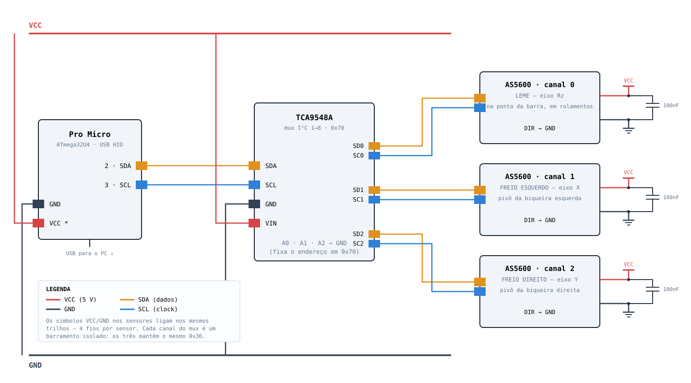

# Open Rudder

Pedal de leme **pendular** para simulação de voo, com sensor magnético sem contato.
Eletrônica, firmware e calibrador abertos.

O ângulo é lido por um **AS5600** (Hall, 12 bits, absoluto) e um **Pro Micro** publica
o resultado como joystick USB HID — sem potenciômetro, sem contato, sem desgaste no
caminho do sinal.

**Estado:** eixo do leme funcionando. Freios de biqueira implementados no firmware,
aguardando montagem mecânica.

## Eixos

| Eixo HID | Fonte | Faixa | Estado |
|---|---|---|---|
| **Rz** | leme | −16383 … +16383 | funcionando |
| **X** | freio de biqueira esquerdo | 0 … 4095 | firmware pronto, mecânica pendente |
| **Y** | freio de biqueira direito | 0 … 4095 | firmware pronto, mecânica pendente |

Rz é o eixo que DCS, MSFS e X-Plane reconhecem direto como leme.

## Arquivos

```
firmware/open_rudder/     firmware principal (leme + 2 freios, USB HID)
firmware/as5600_angle/    sketch mínimo de diagnóstico do sensor
web/calibrador.html       calibrador por Web Serial (Chrome/Edge)
hardware/ligacao.svg      diagrama de ligação
hardware/perfurada.svg    layout da placa perfurada (imprimível 1:1)
hardware/diagrama.html    as duas folhas acima, prontas para imprimir
```

## Eletrônica

O endereço I²C do AS5600 é **fixo em 0x36 e não é programável**, então os três sensores
não coexistem no mesmo barramento. Por isso o **TCA9548A**: cada sensor fica isolado em
um canal, e o firmware chaveia entre eles.



Detalhes de montagem, capacitores, cabeamento e o layout da placa estão em
`hardware/diagrama.html` — abra no navegador e imprima: a folha da perfurada sai em
tamanho real e serve de gabarito.

> **Atenção à tensão:** o AS5600 é 3,3 V. Se o seu Pro Micro for 5 V, nada do barramento
> pode ver 5 V — veja a nota 1 do diagrama.

### Lista de material (só a eletrônica)

| Item | Qtd | ~R$ |
|------|-----|-----|
| Pro Micro (ATmega32U4, USB HID nativo) | 1 | 35 |
| Módulo AS5600 | 3 | 75 |
| Ímã diametral Ø6×2,5 mm | 3 | 24 |
| Multiplexador I²C TCA9548A | 1 | 12 |
| Placa perfurada 7×9 cm, conectores, cabo par trançado | — | 25 |
| **Total** | | **~R$ 170** |

O ímã tem que ser **diametral** (magnetizado de lado a lado, não axial), centrado no
eixo, a 0,5–3 mm da face marcada do chip.

## Firmware

Precisa da biblioteca [Joystick](https://github.com/MHeironimus/ArduinoJoystickLibrary)
(2.1.1+). Placa: Arduino Micro / Leonardo (ou SparkFun Pro Micro, se você tiver o pacote
instalado).

```bash
arduino-cli compile --fqbn arduino:avr:micro firmware/open_rudder
arduino-cli upload -p COM5 --fqbn arduino:avr:micro firmware/open_rudder
```

Como funciona:

- **Round-robin de 1 kHz** pelos canais do mux — 333 Hz por eixo, de sobra para um pedal.
- **Calibração por eixo na EEPROM**: zero, batentes, inversão, deadzone e expo.
- O zero é resolvido em coordenadas relativas com wrap em ±2048, então **o centro pode
  cair em qualquer ponto do giro** do ímã — não importa como o ímã ficou na montagem.
- **Filtro EMA** (α = 0,35) mata o jitter de ±1 count sem atraso perceptível.
- **Sem o TCA9548A ligado**, cai sozinho para o modo de 1 sensor (só o leme) — dá para
  montar por partes.

Com cabo longo até as biqueiras, se aparecer `sem resposta no eixo`, baixe `I2C_CLOCK`
para `100000` no topo do sketch.

## Calibração

Sem calibrar, o eixo não significa nada: o AS5600 mede 0–360° absolutos e o centro do
seu pedal cai num ponto arbitrário desse círculo.

1. Rode `web/servir.bat` (sobe um servidor local e abre o navegador).
2. **Conectar** e escolha a porta do Arduino.
3. Leme: Centro → Batente esquerdo → Batente direito. Freios: Repouso → Fundo.
4. **Gravar na EEPROM**.

A página mostra os três eixos ao vivo, o status dos ímãs (AGC) e onde o curso útil cai
no giro completo do sensor. Detalhes em `web/README.md`.

> A Web Serial API só funciona em **Chrome ou Edge** e em contexto seguro — por isso o
> `servir.bat`, em vez de abrir o HTML direto pelo Explorer.

## Mecânica

*A documentar:* arquitetura pendular, materiais, dimensões, curso e acoplamento do ímã
ao eixo.

Duas restrições que o sensor impõe ao projeto mecânico:

- **Freios:** mire **10–15° de curso** no pivô da biqueira. O AS5600 dá 0,088° por count,
  então 10° ≈ 115 counts — abaixo disso a dosagem fica granulada.
- **Leme:** ±17° usam ~9% do giro do sensor, o que dá ~380 counts no curso total.
  Equivale a um potenciômetro de 9 bits: suficiente, mas é o teto de resolução.

## Licença

*A definir.*
